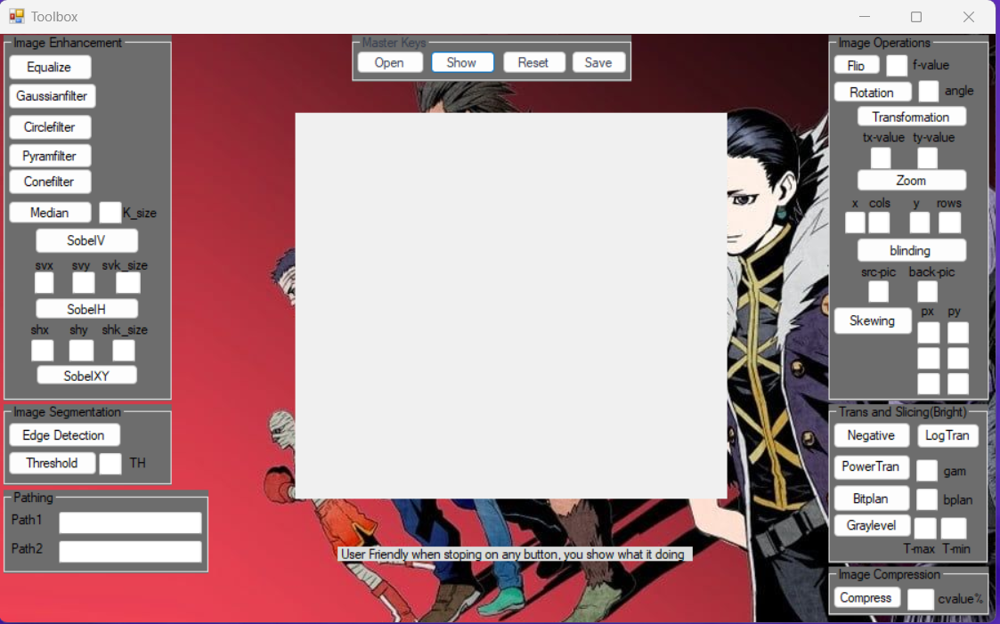

# Digital Image Processing

The Image Processing Toolbox provides a set of functions and applications for image processing, analysis, and visualization. There are many functions available for image analysis, image segmentation, image enhancement, noise reduction, geometric transformations, and image registration.
